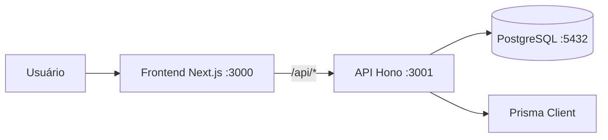

# Guia de Arquivos do CVET

Este documento descreve a responsabilidade dos arquivos versionados do sistema CVET. O projeto possui um frontend Next.js, uma API Hono, PostgreSQL acessado por Prisma e execução local por Docker Compose.

## Visão da arquitetura

O frontend usa `fetch('/api/...')`. O arquivo de configuração do Next redireciona essas chamadas para a API. A API aplica validação com Zod, executa regras de negócio e persiste dados no PostgreSQL.

## Arquivos da raiz

| Arquivo | Responsabilidade |
| --- | --- |
| `docker-compose.yml` | Orquestra os serviços `db`, `api` e `web`. Define portas, variáveis de ambiente, volume do banco, healthchecks e dependências de inicialização. |
| `README.md` | Guia de instalação, execução com Docker ou localmente, testes, funcionalidades e links de deploy/documentação. |
| `render.yaml` | Descreve os serviços usados no deploy pelo Render. |

## Backend

### Configuração e execução

| Arquivo | Responsabilidade |
| --- | --- |
| `backend/package.json` | Define dependências da API e scripts de desenvolvimento, inicialização do banco, testes e typecheck. |
| `backend/tsconfig.json` | Configura a compilação TypeScript do backend, resolução de módulos Node e verificações estritas. |
| `backend/vitest.config.ts` | Configura o Vitest para executar testes da API no ambiente Node. |
| `backend/prisma.config.ts` | Informa ao Prisma a localização do schema, migrations e comando de seed. |
| `backend/Dockerfile` | Cria a imagem da API em múltiplos estágios, instala dependências, gera o cliente Prisma e copia somente os artefatos necessários para execução. |
| `backend/docker-entrypoint.sh` | Inicializa ou atualiza o banco pelo script SQL e inicia a API Hono. |

### Entrada da aplicação

| Arquivo | Responsabilidade |
| --- | --- |
| `backend/src/index.ts` | Abre o servidor HTTP Node e disponibiliza a aplicação Hono na porta configurada. |
| `backend/src/app.ts` | Monta a aplicação Hono, configura logs e CORS, expõe `/api/health` e registra todas as rotas da API. |

### Rotas da API

| Arquivo | Responsabilidade |
| --- | --- |
| `backend/src/routes/auth.ts` | Valida login por e-mail e senha, verifica o hash com `scrypt` e retorna os dados do usuário autenticado. |
| `backend/src/routes/usuarios.ts` | Lista e cadastra usuários, valida campos e impede duplicidade de CPF ou e-mail. |
| `backend/src/routes/tutores.ts` | Lista e cadastra tutores, incluindo os pets informados durante o cadastro. |
| `backend/src/routes/pets.ts` | Lista pets junto dos dados de seus tutores. |
| `backend/src/routes/leitos.ts` | Lista e cadastra leitos normais ou UTI, com valor de diária e validações de identificação. |
| `backend/src/routes/internacoes.ts` | Lista apenas internações sem baixa, cria internações com validação de leito e período, consulta detalhes, altera dados clínicos e gerencia as medicações vinculadas. Também calcula horários a partir da frequência de cada medicação. |
| `backend/src/routes/financeiro.ts` | Calcula diárias, total, pagamentos e saldo. Ao quitar o saldo, registra o pagamento, encerra a internação e marca a flag `baixa` como verdadeira. |
| `backend/src/routes/analytics.ts` | Produz os dados agregados consumidos pelo dashboard: totais, status, espécies e volume por dia. |

### Bibliotecas internas

| Arquivo | Responsabilidade |
| --- | --- |
| `backend/src/lib/prisma.ts` | Cria e reutiliza uma instância do `PrismaClient` configurada para PostgreSQL. |
| `backend/src/lib/horarios.ts` | Calcula os horários diários de uma medicação a partir do primeiro horário e da frequência em horas. |

### Banco de dados

| Arquivo | Responsabilidade |
| --- | --- |
| `backend/prisma/schema.prisma` | Fonte de verdade do modelo Prisma. Define Usuario, Tutor, Pet, Leito, Internacao, Medicacao, Pagamento e FormaPagamento, suas colunas e relações. `Medicacao` é relacionada a `Internacao` por `internacaoId`; `baixa` identifica internações quitadas/encerradas. |
| `backend/prisma/seed.ts` | Script de seed configurado pelo Prisma para popular dados de desenvolvimento quando utilizado. |
| `backend/prisma/migrations/migration_lock.toml` | Registra que as migrations do projeto usam PostgreSQL. Não deve ser alterado manualmente. |
| `backend/scripts/init-db.mjs` | Inicialização idempotente usada pelo container: cria tabelas, adiciona colunas em bancos antigos, garante dados base e marca como baixa internações previamente quitadas. |

### Testes

| Arquivo | Responsabilidade |
| --- | --- |
| `backend/src/__tests__/internacoes.test.ts` | Exercita endpoints de internação com Vitest e Prisma simulado, cobrindo respostas de consulta, criação, atualização e remoção. |

### Cliente Prisma gerado

Os arquivos abaixo são produzidos por `npx prisma generate` usando `backend/prisma/schema.prisma`. Não devem ser modificados manualmente.

| Arquivo ou diretório | Responsabilidade |
| --- | --- |
| `backend/generated/prisma/client.ts` | Exporta o cliente Prisma tipado usado pelo backend. |
| `backend/generated/prisma/browser.ts` | Variante de tipos do Prisma destinada a uso em navegador. |
| `backend/generated/prisma/commonInputTypes.ts` | Declara tipos compartilhados de entrada e filtros do Prisma. |
| `backend/generated/prisma/enums.ts` | Exporta enums gerados do schema; pode estar vazio quando não há enums. |
| `backend/generated/prisma/models.ts` | Reexporta os tipos de todos os modelos. |
| `backend/generated/prisma/models/Internacao.ts` | Tipos Prisma específicos para o modelo `Internacao`. |
| `backend/generated/prisma/models/Medicacao.ts` | Tipos Prisma específicos para o modelo `Medicacao`. |
| `backend/generated/prisma/models/Pet.ts` | Tipos Prisma específicos para o modelo `Pet`. |
| `backend/generated/prisma/models/Tutor.ts` | Tipos Prisma específicos para o modelo `Tutor`. |
| `backend/generated/prisma/internal/class.ts` | Implementação interna da classe do cliente Prisma. |
| `backend/generated/prisma/internal/prismaNamespace.ts` | Declarações internas do namespace Prisma para Node. |
| `backend/generated/prisma/internal/prismaNamespaceBrowser.ts` | Declarações internas do namespace Prisma para navegador. |

## Frontend

### Configuração e execução

| Arquivo | Responsabilidade |
| --- | --- |
| `frontend/package.json` | Define dependências e scripts do frontend: desenvolvimento, build, execução, lint, teste e typecheck. |
| `frontend/tsconfig.json` | Configura TypeScript, JSX, modo estrito e o alias `@/` para `src/`. |
| `frontend/next-env.d.ts` | Arquivo gerado/requerido pelo Next para disponibilizar tipos do framework. Não deve ser editado manualmente. |
| `frontend/next.config.mjs` | Configura build standalone, Turbopack e o rewrite de `/api/*` para a URL da API. |
| `frontend/eslint.config.mjs` | Configura regras de lint do Next e ESLint. |
| `frontend/vitest.config.ts` | Configura Vitest, React, aliases e o ambiente de DOM para testes de componentes. |
| `frontend/tailwind.config.ts` | Define caminhos analisados pelo Tailwind e tokens visuais, como cores e sombras do sistema. |
| `frontend/postcss.config.mjs` | Habilita Tailwind e Autoprefixer durante o processamento CSS. |
| `frontend/Dockerfile` | Gera a imagem standalone do Next.js e prepara o servidor de produção na porta 3000. |
| `frontend/docker-entrypoint.sh` | Inicia o servidor standalone gerado pelo Next. |

### Estrutura global

| Arquivo | Responsabilidade |
| --- | --- |
| `frontend/src/app/layout.tsx` | Layout raiz da aplicação, fontes, metadados e composição da estrutura compartilhada. |
| `frontend/src/app/globals.css` | Estilos globais, normalizações, cores de fundo e comportamento visual base. |
| `frontend/src/components/app-shell.tsx` | Protege a área autenticada usando a sessão local e organiza sidebar e conteúdo principal. |
| `frontend/src/components/sidebar.tsx` | Renderiza a navegação principal em desktop e mobile. |
| `frontend/src/components/site-header.tsx` | Cabeçalho com identidade visual e atalhos de navegação. |
| `frontend/src/components/backend-wakeup.tsx` | Consulta o healthcheck da API com tentativas para aguardar seu despertar em provedores que suspendem serviços. |
| `frontend/src/lib/app-info.ts` | Centraliza constantes de identidade e informações institucionais do CVET. |

### Páginas

| Arquivo | Responsabilidade |
| --- | --- |
| `frontend/src/app/page.tsx` | Página inicial com visão geral do sistema. |
| `frontend/src/app/login/page.tsx` | Tela de autenticação; envia credenciais para a API e armazena a sessão local. |
| `frontend/src/app/internacoes/page.tsx` | Define título, contexto e renderiza o quadro operacional de internações. |
| `frontend/src/app/internacoes/[id]/page.tsx` | Rota dinâmica que entrega o identificador para a tela de detalhe da internação. |
| `frontend/src/app/leitos/page.tsx` | Tela de listagem e cadastro de leitos. |
| `frontend/src/app/tutores/page.tsx` | Tela de listagem e cadastro de tutores, com inclusão de um ou mais pets. |
| `frontend/src/app/financeiro/page.tsx` | Exibe totais, saldos e o formulário de quitação que baixa e encerra a internação. |
| `frontend/src/app/usuarios/page.tsx` | Tela de listagem e cadastro de usuários do sistema. |
| `frontend/src/app/analytics/page.tsx` | Página que hospeda o dashboard analítico. |
| `frontend/src/app/mapa/page.tsx` | Tela de mapa diário de administração de medicações. |

### Componentes de internação

| Arquivo | Responsabilidade |
| --- | --- |
| `frontend/src/components/internacoes/internacoes-board.tsx` | Componente principal da relação de internações: carrega dados, mostra indicadores, busca e filtra registros. Cada linha pode expandir a sub-tabela de medicações para inclusão, edição, persistência e remoção sem sair da grade. |
| `frontend/src/components/internacoes/internacao-form.tsx` | Formulário para abrir uma internação, selecionando pet, leito, período, status e demais dados clínicos. |
| `frontend/src/components/internacoes/internacao-detalhe.tsx` | Consulta e apresenta uma internação específica, permitindo alterar status e gerenciar medicações. |
| `frontend/src/components/internacoes/internacao-card.tsx` | Apresentação alternativa compacta de uma internação com link para seus detalhes. |
| `frontend/src/components/internacoes/status-badge.tsx` | Exibe o status clínico como badge visual, aplicando cor e rótulo consistentes. |

### Componentes de analytics e mapa

| Arquivo | Responsabilidade |
| --- | --- |
| `frontend/src/components/analytics/analytics-dashboard.tsx` | Busca os dados analíticos e organiza indicadores e gráficos. |
| `frontend/src/components/analytics/status-donut.tsx` | Gráfico de distribuição de internações por status. |
| `frontend/src/components/analytics/especie-bar.tsx` | Gráfico de internações agrupadas por espécie. |
| `frontend/src/components/analytics/volume-line.tsx` | Gráfico de volume de internações ao longo dos últimos dias. |
| `frontend/src/components/mapa/mapa-grid.tsx` | Constrói a grade de horários de medicação por paciente e data selecionada. |

### Tipos e regras de interface

| Arquivo | Responsabilidade |
| --- | --- |
| `frontend/src/types/internacao.ts` | Define contratos TypeScript para status, medicação persistida, entrada de medicação, internação e criação de internação. |
| `frontend/src/lib/horarios.ts` | Calcula os horários diários e determina a próxima medicação apresentada na interface. |

### Testes do frontend

| Arquivo | Responsabilidade |
| --- | --- |
| `frontend/src/test/setup.ts` | Carrega extensões do Testing Library para asserções do Vitest. |
| `frontend/src/components/internacoes/__tests__/status-badge.test.tsx` | Verifica os rótulos renderizados pelo componente de status. |

## Documentação existente

| Arquivo | Responsabilidade |
| --- | --- |
| `docs/planejamento_projeto_cvet.md` | Planejamento do projeto, requisitos, arquitetura e roadmap. |
| `docs/rfc-internacoes-leitos.md` | Decisões técnicas para vínculo entre internações, pets, leitos, conflitos de período e diárias. |
| `docs/apresentacao.md` | Material de apresentação resumido do projeto. |
| `docs/apresentacao-v2.0.md` | Versão revisada do material de apresentação. |
| `docs/guia-arquivos.md` | Este guia: referência de responsabilidades por arquivo. |

## Fluxos importantes

### Internação e medicação

1. Um tutor e seus pets são cadastrados.
2. Uma internação associa um pet a um leito e um período.
3. Cada medicação é salva na tabela `Medicacao` com `internacaoId`.
4. A grade de internações permite abrir uma sub-tabela para incluir, editar ou remover suas medicações.
5. Medicações e horários são usados no detalhe e no mapa de execução.

### Pagamento e baixa

1. O financeiro calcula o saldo usando a diária do leito e os pagamentos registrados.
2. A quitação exige o valor integral do saldo.
3. A API grava o pagamento, define a saída, atualiza o valor das diárias e marca `baixa: true` na mesma transação.
4. A rota operacional de internações consulta somente `baixa: false`; por isso o paciente quitado não aparece mais nessa relação.